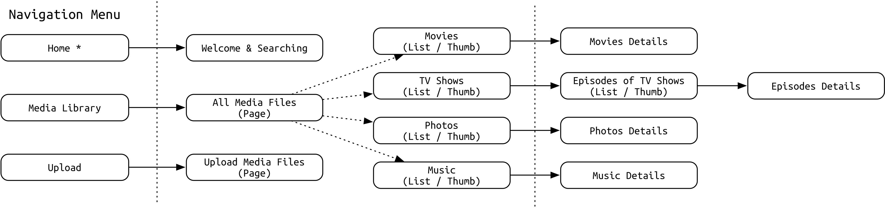
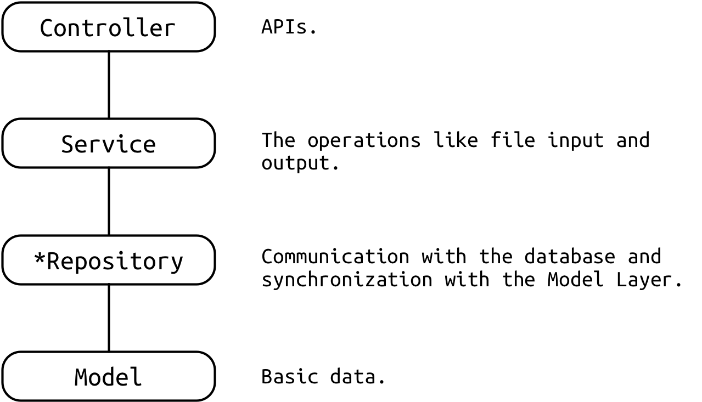
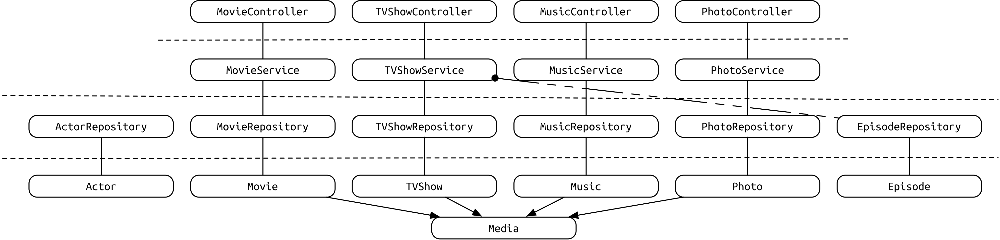

## About Assignment

Carl Li, student number 20155134

Linfeng Zhao, student number 20155298

### About Delay (Assignment 2)

We are very sorry for the late of the assignment. We have talked with you on the class of Monday about our situation: we encountered a bug in the front-end project logic, and back-end and whole user-interface in front-end project were finished. Now we fix the problem successfully and modify some of the design. Some extra information can be checked on commit histories of our GitHub repository.

## Running Prerequisites - Important

### About Deployment !! IMPORTANT !!

​	Create the MySQL database as in   `application.properties`. 

​	Run the app by   `mvn spring-boot:run`.

### About Zooming

​	Because of the size of the elements, you may need to adjust the zooming factor of the browser.

## Major Changes in Assignment 3

​	**Here is some relatively major changes in our view. Other changes may not be major enough (or be forgot) and all changes and its meaning can be seen directly in the Git commit history.**

### Back-End

1. The structure of the back-end project is redesigned to **communicate with MySQL database using ORM.**
   1. The File Model Layer is replaced by Repository Layer. The new design of the structure is shown in the diagrams in this document.
2. Some new APIs (Controller Layer) are used to optimize the performance, like an API for removing a list of media at one time to save the time of communication between back-end and front-end.
3. About database design: Spring Boot and its internal Hibernate would auto-detect the annotation-based models (`@Entity`, `@Column`) so the pattern of database is the same as the structure of model classes (`Media` as super class, `TVShow`, `Movie` as subclass, etc.).
4. Some modifications and improvements in the other layers.
   1. A bug in deleting file is fixed. In Assignment 2, in some case the media files may not be removed although the records are removed in the database or the XML files.
   2. `Runtime` attribute in TV Shows is changed to `duration`. Some misunderstanding in the meaning of the attributes are modified.

### Front-End

1. Many improvements of User Interface.
   1. The style of some elements are modified to beautify the UI.
   2. Some new UI elements (`Element UI`) are introduced in the UI.
2. The List Mode and Thumbnail Mode are redesigned and now users can <u>choose multiple media files and delete them</u>.
3. The details of media files can be changed now.
4. ...

## Navigation Map and its Summary 

​	Currently, the home page of our Media Library System is for searching using Ajax (the results will be updated after each keystrokes).

​	At the left side, there is a navigation menu, which includes the links to all the pages of the media library. The links are divided into two group: "Home Page and Searching" and "Media Library Navigation".

​	In "Home", there are two tabs named Home and Searching and the searching tab is set as the default tab of the page.

​	"Media Library" is a menu which has five sub menu items. The first sub item is to show all the items in the media library in `list mode`. The other items are able to show the corresponding items in both `list mode` and `thumbnail mode`.

​	Additionlly, the upload function is provided in the "Upload" page. There is two tabs in the page. The first tab is to upload four basic media types (TV Shows / Movies / Music / Photos). The second tab provides the functionality of uploading new episodes to a existing TV Show.



## Summary of design decisions

### About the design of Back-End

​	**The Back-End project is what we devote to most. In Assignment 3, to communicate with the MySQL database, a new layer named `Repository` Layer is introduced.**

​	For back-end, we devide the whole project to four layers as following for utilitizing development for our team of two:



​	The explanations of the each layer are in the following section.

### Four Layers Design (Bottom-Up)

#### 1 - Model Layer

​	The firstly introduced layer is "Model" Layer which is in the bottom of the system.

​	For "Model" Layer, the fields of each model are corresponding to the fields of the   `.nfo` file. In the next layers, the objects of the `Model` Layer will be used to store the data of the corresponding type of media and be assigned to transfer the data.

​	There is a common super class named   `Media.java`:

```java
package project.mediavault.model;

import lombok.Data;

@Data
public abstract class Media {
    // Basic Media Information
    private int id;
    private String title;
    private double rating;

    // Information of storing
    private String thumbnailURL;
    private String fileURL;

    // Measurement Unit = Byte
    private Long size; // For TV Shows, the value of (total) size can be null
}
```

​	**In addition, the `Lombok` Library is used for automatically invoking the getters and setters.** 

#### 2 - File Model Layer (Deprecated, new `Repository` Layer is used)

​	The   `File` Model Layer is for synchronizing with XML files. <u>This part will be updated in the Assignment 3 for communciating with a database using JDBC and other high level APIs like **Spring Data JPA**.</u> 

​	In Assignment 2, each class of this layer has two functionalities. The initialization steps is shown below:

```java
import org.w3c.dom.Document;
import org.w3c.dom.Element;
import org.w3c.dom.Node;
import org.w3c.dom.NodeList;
import project.mediavault.model.Movie;

import javax.xml.parsers.DocumentBuilder;
import javax.xml.parsers.DocumentBuilderFactory;
import javax.xml.parsers.ParserConfigurationException;
import java.util.List;

public class MovieFile {
    private Movie movie;
    private Document document;

    public MovieFile(Movie movie) {
        this.movie = movie;
        updateDocumentFromMovie();
    }

    public MovieFile(Document document) {
        this.document = document;
        updateMovieFromDocument();
    }

    // TODO Media File
    public Movie getMovie() {
        return this.movie;
    }

    public void setMovie(Movie movie) {
        this.movie = movie;
        updateDocumentFromMovie();
    }

    // TODO Document
    public Document getDocument() {
        return this.document;
    }

    public void setDocument(Document document) {
        this.document = document;
        updateMovieFromDocument();
    }
  
  	// Other methods will be demonstrated later
}
```

​	The first one is **delegating** the getters and setters for media file. In the example, the Movie file model is shown (`private Movie movie;`).

```java
    // TODO Basic Fields
    public int getId() {
        return movie.getId();
    }

    public void setId(int id) {
        movie.setId(id);
        updateDocumentFromMovie();
    }

    public String getTitle() {
        return movie.getTitle();
    }

    public void setTitle(String title) {
        movie.setTitle(title);
        updateDocumentFromMovie();
    }

    public double getRating() {
        return movie.getRating();
    }

    public void setRating(double rating) {
        movie.setRating(rating);
        updateDocumentFromMovie();
    }

    public String getThumbnailURL() {
        return movie.getThumbnailURL();
    }

    public void setThumbnailURL(String thumbnailURL) {
        movie.setThumbnailURL(thumbnailURL);
        updateDocumentFromMovie();
    }

    public String getFileURL() {
        return movie.getFileURL();
    }

    public void setFileURL(String fileURL) {
        movie.setFileURL(fileURL);
        updateDocumentFromMovie();
    }

    public Long getSize() {
        return movie.getSize();
    }

    public void setSize(Long size) {
        movie.setSize(size);
        updateDocumentFromMovie();
    }

    // TODO Extra Fields
    public String getDuration() {
        return movie.getDuration();
    }

    public void setDuration(String duration) {
        movie.setDuration(duration);
        updateDocumentFromMovie();
    }

    public String getPlot() {
        return movie.getPlot();
    }

    public void setPlot(String plot) {
        movie.setPlot(plot);
        updateDocumentFromMovie();
    }

    public List<String> getGenres() {
        return movie.getGenres();
    }

    public void setGenres(List<String> genres) {
        movie.setGenres(genres);
        updateDocumentFromMovie();
    }
```

​	The method   `updateDocumentFromMovie()` will be invoked for updating the document. This method will be demonstrated later.

​	The second one is to synchronize with the XML document file:

```java
// TODO Update Document
    private void updateDocumentFromMovie() {
        try {
            document = DocumentBuilderFactory.newInstance().newDocumentBuilder().newDocument();
        } catch (ParserConfigurationException e) {
            e.printStackTrace();
        }

        Document d = document;
        Node rootElement = d.createElement("movie");

        Node idElement = d.createElement("id");
        idElement.appendChild(d.createTextNode("" + getId()));
        Node titleElement = d.createElement("title");
        titleElement.appendChild(d.createTextNode(getTitle()));
        Node thumbnailURLElement = d.createElement("thumbnailURL");
        thumbnailURLElement.appendChild(d.createTextNode(getThumbnailURL()));
        Node fileURLElement = d.createElement("fileURL");
        fileURLElement.appendChild(d.createTextNode(getFileURL()));
        Node sizeElement = d.createElement("size");
        sizeElement.appendChild(d.createTextNode("" + getSize()));
        Node ratingElement = d.createElement("rating");
        ratingElement.appendChild(d.createTextNode("" + getRating()));

        rootElement.appendChild(idElement);
        rootElement.appendChild(titleElement);
        rootElement.appendChild(thumbnailURLElement);
        rootElement.appendChild(fileURLElement);
        rootElement.appendChild(sizeElement);
        rootElement.appendChild(ratingElement);

        Node durationElement = d.createElement("duration");
        durationElement.appendChild(d.createTextNode(getDuration()));
        Node plotElement = d.createElement("plot");
        plotElement.appendChild(d.createTextNode(getPlot()));

        rootElement.appendChild(durationElement);
        rootElement.appendChild(plotElement);
        getGenres().forEach(genre -> {
            Element element = d.createElement("genre");
            element.appendChild(d.createTextNode(genre));
            rootElement.appendChild(element);
        });


        document.appendChild(rootElement);
    }

    private void updateMovieFromDocument() {
        Document d = document;
        movie = new Movie();
        movie.setId(Integer.parseInt(d.getElementsByTagName("id").item(0).
                getTextContent()));
        movie.setTitle(d.getElementsByTagName("title").item(0).
                getTextContent());
        movie.setSize(Long.parseLong(d.getElementsByTagName("size").item(0).
                getTextContent()));
        movie.setFileURL(d.getElementsByTagName("fileURL").item(0).
                getTextContent());
        movie.setThumbnailURL(d.getElementsByTagName("thumbnailURL").item(0).
                getTextContent());
        movie.setRating(Double.parseDouble(d.getElementsByTagName("rating").item(0).
                getTextContent()));

        NodeList genreNodeList = d.getElementsByTagName("genre");
        for (int i = 0; i < genreNodeList.getLength(); ++i) {
            movie.getGenres().add(genreNodeList.item(i).getTextContent());
        }
        movie.setPlot(d.getElementsByTagName("plot").item(0).getTextContent());
        movie.setDuration(d.getElementsByTagName("duration").item(0).getTextContent());
    }
```

​	`updateDocumentFromMovie()` will be invoked in every setter calls.

#### 2* - Repository Layer

​	**`Repository` layer is designed for communicating with the MySQL database using Spring Data JPA. The interfaces need not have any implementation and just a annotation `@Repository` is need to nofity the Spring framework to detect the annotation-driven repositories.**

​	This layer is newly introduced in the Assignment 3.

​	Here is a example of the `TVShowRepository`.

```java
package project.mediavault.repository;

import org.springframework.data.jpa.repository.JpaRepository;
import org.springframework.data.jpa.repository.JpaSpecificationExecutor;
import org.springframework.stereotype.Repository;
import project.mediavault.model.TVShow;

@Repository
public interface TVShowRepository extends JpaRepository<TVShow, Integer>, JpaSpecificationExecutor<TVShow> {
    // Nothing here
}
```

#### 3 - Service Layer

​	**The   `Service` classes in Service Layer are providing the functionality of modifying the config files (XML in `.nfo` in Assignment 2 and communication with the database in Assignment 3) and corresponding actual media files in the file system.**

​	In this layer, many high level APIs are used. Here is a example:

```java
package project.mediavault.service;

import org.springframework.beans.factory.annotation.Autowired;
import org.springframework.stereotype.Service;
import project.mediavault.model.Movie;
import project.mediavault.repository.MovieRepository;

import java.util.*;

/**
 * Movie Service.
 */
@SuppressWarnings("Duplicates")
@Service
public class MovieService {

    private MovieRepository movieRepository;

    @Autowired
    public MovieService(MovieRepository movieRepository) {
        this.movieRepository = movieRepository;
    }

    public List<Movie> getAllList() {
        return movieRepository.findAll();
    }

    public boolean saveNewMovie(Movie movie) {
        try {
            movieRepository.save(movie);
        } catch (Exception e) {
            e.printStackTrace();
            return false;
        }
        return true;
    }

    public boolean modifyExistedMovie(Movie movie) {
        return saveNewMovie(movie);
    }

    public boolean deleteMovie(int id) {
        try {
            movieRepository.delete(id);
        } catch (Exception e) {
            e.printStackTrace();
            return false;
        }
        return true;
    }

    public Movie getMovieById(int id) {
        return movieRepository.findOne(id);
    }
}
```

#### 4 - Controller Layer

​	The   `Controller` layer is at the top of our back-end project. The most important objective of this layers is to provide the APIs for front-end project to communicate with our media server (back-end server).

​	Some common and important APIs are shown below using Movies Controller:

```Java
/**
 * Movies Controller / APIs
 */
@RestController
@RequestMapping("/api/movie")
public class MovieController {
    private MovieService movieService;
  
    /**
     * The parameter is Autowired by Spring Framework
     * 
     * @param movieService will be autowired by Spring Framework
     */
    @Autowired
    public MovieController(MovieService movieService) {
        this.movieService = movieService;
    }

    /**
     * Get the movie list and return a ResponseEntity of ModelMap for GET request
     *
     * @return a ResponseEntity of ModelMap
     */
    @GetMapping
    public ResponseEntity<ModelMap> getAllList() {
        List<Movie> movieList = movieService.getAllList();
        ModelMap resultMap = new ModelMap("isSuccessful", true)
                .addAttribute("data", movieList);
        return ResponseEntity.ok(resultMap);
    }

    /**
     * Add a new movie
     *
     * @param movie movie entity (@RequestBody)
     * @return a ResponseEntity of ModelMap
     */
    @PostMapping
    public ResponseEntity<ModelMap> addNewMovie(@RequestBody Movie movie) {
        // TODO [ newly modified ]
        boolean result = movieService.saveNewMovie(movie);
        if (result) {
            return ResponseEntity.ok(new ModelMap("isSuccessful", true));
        } else {
            return ResponseEntity.ok(new ModelMap("isSuccessful", false));
        }
    }

    /**
     * Delete a movie
     *
     * @param id of the movie (@PathVariable)
     * @return a ResponseEntity of ModelMap of the deletion result
     */
    @DeleteMapping("/{id}")
    public ResponseEntity<ModelMap> deleteMovie(@PathVariable("id") int id) {
        boolean result = movieService.deleteMovie(id);
        return ResponseEntity.ok(new ModelMap("isSuccessful", result));
    }

    /**
     * Get the detail of the movie
     *
     * @param id of the movie (@PathVariable)
     * @return a ResponseEntity of ModelMap containing the details
     */
    @GetMapping("/{id}")
    public ResponseEntity<ModelMap> getMovieDetail(@PathVariable("id") int id) {
        Movie movie = movieService.getMovieById(id);
        ModelMap resultMap = new ModelMap("isSuccessful", true)
                .addAttribute("data", movie);
        return ResponseEntity.ok(resultMap);
    }
}
```

### The Relationships between the Classes of Whole Back-End Project

​	For fully demonstrating the structure the back-end project, the diagram of the relationship of the classes of each layer is provided and shown below:

​	

​	Each rectangle means a Java class.

### Decision: Metadata XML Storage vs. Database Storage

​	In assignment 2 we finished the metadata database in XML; In assignment 3 we migrated from XML to MySQL database.

​	There is advantage with XML storage that XML is such a good type to store POJOs, in which tags could be easily mapped to objects or primitive data types in Java. However, for data accessing like `getAll()` method, it is necessary for the program I/O to open all the files, which would be slower to process than the relational database approach.

​	For relational databases, data accessing could always be finished with a SQL statement, without the burden for developers to manage so many files, opening and closing. However, the object to relational mapping would be a little hard for developers to handle, without libraries like Hibernate or MyBatis. Since there are some kinds of ORMs available, in real world of software development, using database is a better choice.

## Comments on innovative features & Problems

### Innovative Features of Back-End

1. Spring Framework: The whole back-end project is based on Spring

   For example, Spring Framework provides some very useful features like "**autowired**"(@Autowired).

2. Lombok Library: `Model` Layer

   By using Lambok library, the getters and setters can be automatically generated (need to use plugins in IDEs because the getter and setters will be generated during compiling time).

3. Many Other High Level APIs used

   1. Java NIO
   2. Java XML Manuplication
   3. Some APIs of Spring Framework

4. Deployment Approach

   1. Actually the front-end and the back-end could be separately deployed; change the content in `BaseURL.js` to let the front-end know where the back-end is.
   2. The hand-in version (`.war`) bundled front-end and back-end together.

5. **(New in Assignment 3) Using JPA to communicate with the MySQL database with just a little change in one layer: replace `File Model` Layer with `Repository` Layer.** This also shows the advantage of our design: dividing the back-end project into several layers.

6. ...

### Innovations Features of Front-End

1. Some animations are used for simulating the real experimence, such as loading process:

```javascript
// Portion of the part of scripts in .vue file
      downloadFile (fileURL) {
        // TODO Delay Loading
        this.fullScreenLoading = true;
        setTimeout(() => {
          this.fullScreenLoading = false;
          window.open(fileURL, '_blank');
        }, 800);
      },

      openDetails (id) {
        // TODO Delay Loading
        this.fullScreenLoading = true;
        setTimeout(() => {
          this.fullScreenLoading = false;
          this.$router.push({name: 'MediaDetails', params: {id: id}})
        }, 300);
      },
// ...
```
2. A Search User Interface using Ajax which shows the search results real-time (synchronizing with the keystrokes)


```javascript
// Vue.js computed property
computed: {
      filteredTableData () {
        return this.entireData.filter(data => {
          if (this.input === '') {
            return true;
          } else {
            return data.title.toLowerCase().includes(this.input.toLowerCase());
          }
        })
      }
}
```


3. **(New in Assignment 3) More than one media items now can be deleted at one time. Here is just a part of the code in the script part the `.vue` file.**

```javascript
	  // TODO Delete Item(s)
      deleteItems () {
        let selectionList = [];
        if (this.multipleSelection !== []) {

          this.multipleSelection.forEach(row => {
              selectionList.push(row.id);
            }
          );

          this.$axios.delete('/api/photo/' + selectionList).then(response => {
            if (response.data.isSuccessful) {
              this.$message({
                type: 'success',
                message: 'Delete Successful'
              });
              this.load();
            }
          }).catch(error => {
            window.console.log(error);
          });
        }
      },

      // TODO Handling selection change events
      handleSelectionChange(val) {
        this.multipleSelection = val;
        window.console.log(val);
        window.console.log(val[0]);
      },
```
4. ...

### Problems of the System

1. The design of the system needs to be polished more. The goal of the front-end design is to close to the Plex.
2. Due to the complexity of the system, a little details might be missing in the media detail page.
3. **To be honest, the UI design of our project is not perfect enough.**
   1. In the thumbnail mode, choosing the image of media is unfortunately unavailable.
   2. **<u>But, the part of the reason of the imperfect of the UI design is that we choose to focus more on the back-end (or the logic part of the front-end). We consider these are more important than the UI design in this course.</u>**


## Contributions

​	For each layer, we contribute almost the same as each other.

​	The Spring Framework is introduced and constructed by  `Carl Li` and the document is mainly written by `Linfeng Zhao`.